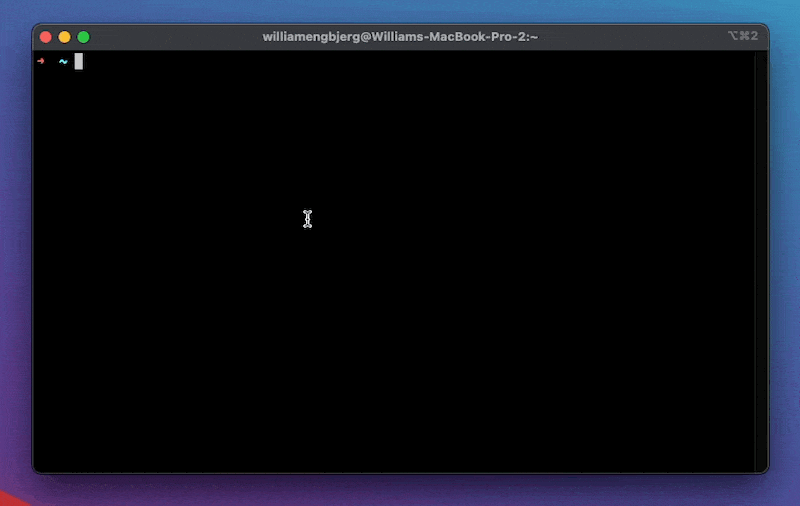

 

# Setup existing/clean magento2 install with DDEV-local.

Only tested on Apple Silicon M1  



Requirements will automatically be installed, except Docker Desktop.

### Requirements

- [Docker Desktop](https://docs.docker.com/docker-for-mac/apple-m1/)
- [DDEV-local](https://ddev.readthedocs.io/en/stable/)
    - [Elasticsearch](https://www.elastic.co/)
- [Mutagen](https://mutagen.io/)

---

## ✨ Usage
Copy/paste curl-command in an existing or empty project folder and enjoy magento2 ☕
```bashpro shell script
bash <(curl -s https://raw.githubusercontent.com/websnack-dk/magento/main/setup.sh)
```

Installing a clean magento2 project requires **Access Keys** (public/private) from [marketplace.magento.com](https://marketplace.magento.com/)

---

### Admin info

Admin url, auto generated. Check `app/ect/env.php`  
User: admin  
Pass: admin123  

--- 

## Helpers
`ddev ssh` into web-container and use shortcut-commands.

```text

# ---- Commands from root via term ---- 

ddev base_url       => Automatic update base_url in core_config_data 

# ---- Custom commands ---- 

magento composer    => Install or upgrade (base) composer packages  
magento deploy      => Enables all modules, except Magento_Csp & Magento_TwoFactorAuth & Runs base setup 
magento rebuild     => Re-compiling all files: Clean, Flush, Upgrade, di:compile & static-content:deploy da_DK  
magento tailwind    => Compile css file, remove generated folders & Clean/flush (Requires tailwind setup in order to work)
magento dump-db     => Export SQL via. magerun2 and removes n98-magerun2.phar

# ---- Data migration, If module is installed ---- 

migrate settings    => Check and run Data migrations
migrate data        => Check and run Settings migration

# ---- Base shortcut helpers ----
 
composer1           => composer self-update --1
composer2           => composer self-update --2
comup               => update composer packages
updatephp           => update-alternatives --config php


# ---- Base Magento2 Shortcuts ----

m                   => bin/magento
mdev                => bin/magento deploy:mode:set developer
mclean              => bin/magento cache:clean
mflush              => bin/magento cache:flush
mdeploy             => bin/magento setup:static-content:deploy -f && bin/magento setup:static-content:deploy -f da_DK
mcompile            => bin/magento setup:di:compile
mupgrade            => bin/magento setup:upgrade
mindexer            => bin/magento indexer:reindex
mcron               => bin/magento cron:run

```

---

## Observe file changes
  
Standard observation files `.phtml` files in `app/frontend/design/Magento_Theme/templates/html`

Observe files:  
Use an external term for watcher. `ddev ssh` to Watcher-folder.   

```bashpro shell script
cd watcher/ && source venv/bin/activate && python3 -m pip install watchdog
```

```bashpro shell script
python watcher.py
```
Change file observers in `watcher/watcher.py`

---

### Maintainer

- [Websnack, William](https://websnack.dk)
